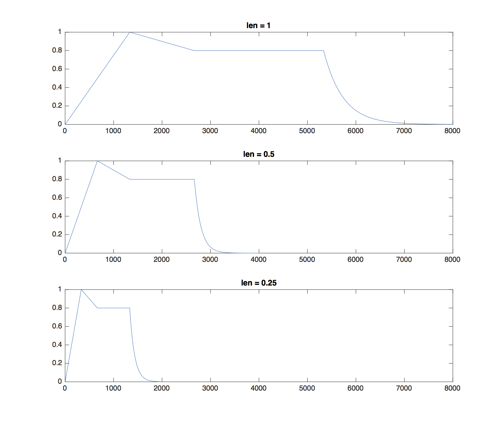
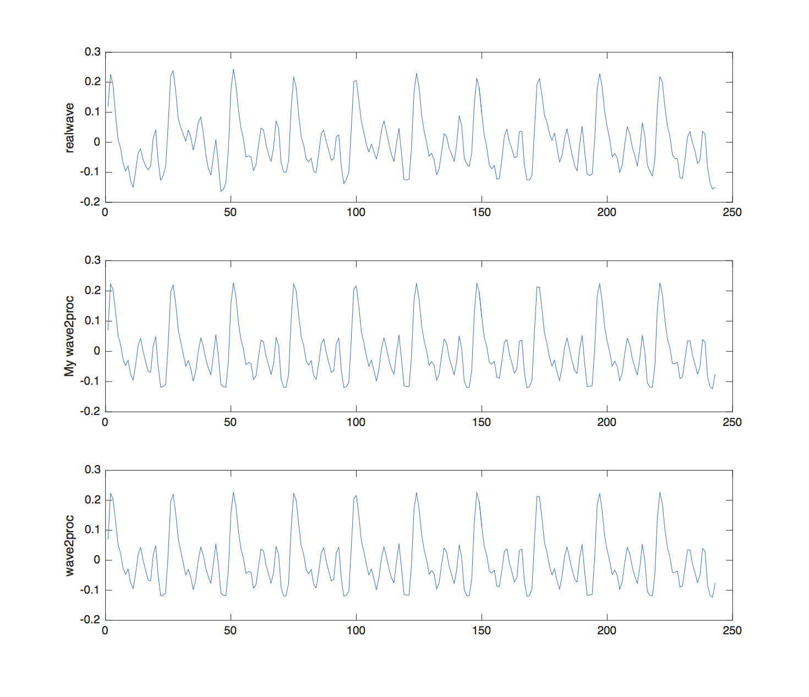
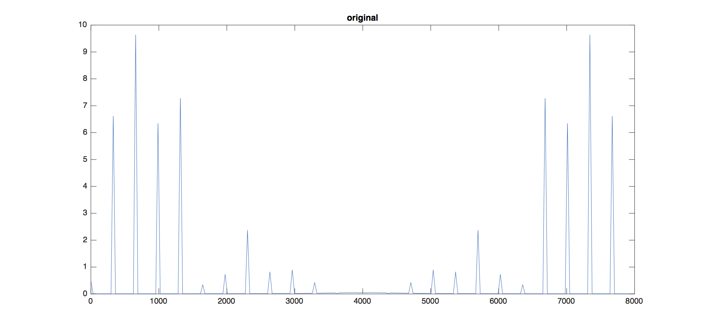
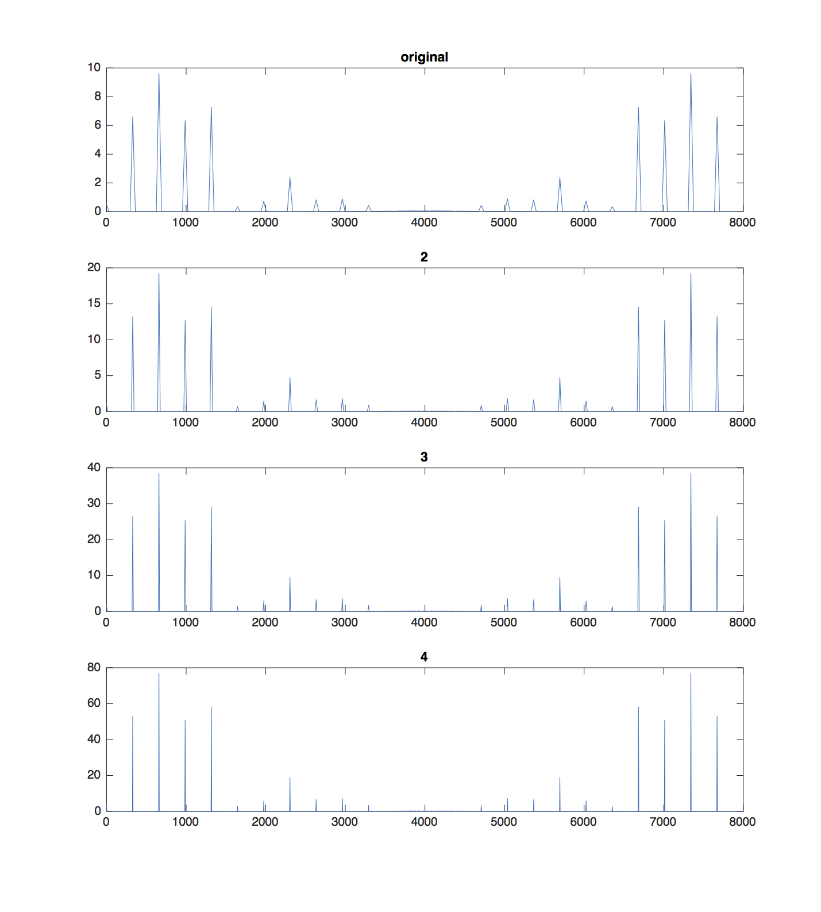
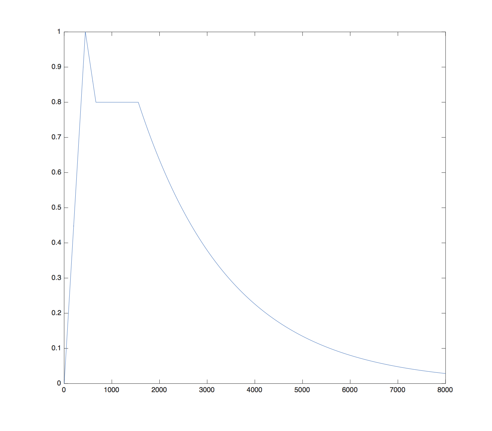
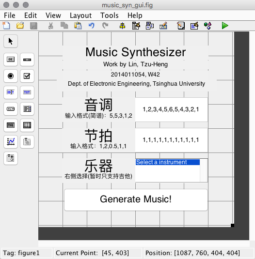
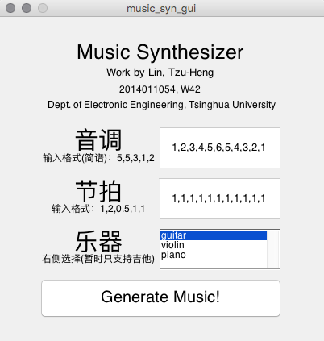

## Music Synthesizer Report
* Work by **_Lin, Tzu-Heng_**, Dept. of Electronic Engineering, Tsinghua University
    * **清华大学 电子工程系 无42 林子恒 2014011054**
    * Email: _**lzhbrian@gmail.com**_ / _**linzh14@mails.tsinghua.edu.cn**_
* See My Github [Repository of This Project](https://github.com/lzhbrian/Matlab-Summer/blob/master/report.md)

### 目录 Content:

***

1. 简单的音乐合成 `Question_1/`
	1. 播放东方红的片段(有啪声) `Oriental_Red.m`
	2. 用包络修正 -> 消除啪啪声 `Oriental_Red_2.m`, `generate_volume.m`
	3. 声调、降调 `Oriental_Red_3.m`
	4. 增加谐波分量 `Oriental_Red_4.m`
	5. 合成贝多芬第五交响乐开头两小节 `Beethoven_5.m`
2. 用傅立叶级数分析音乐 `Question_2/`
	1. 播放 fmt.wav `load_data.m`
	2. 预处理 -> 生成 wave2proc 信号 `preprocessing.m`
	3. 分析音乐的基频、谐波分量 `Freq_Analyze.m`
	4. 自动化分析 fmt.wav 的基频、谐波分量 `Analyze_fmt.m`
3. 基于傅立叶级数的音乐合成 `Question_3/`
	1. 用 2.3 算出的谐波分量, 再次完成 1.4 `Oriental_Red_with_harm_1.m`,
	 `generate_volume_for3.m`
	2. 用 2.4 分析出的谐波分量, 再次完成 1.4 `Oriental_Red_with_harm_2.m`
	3. 将上述功能封装成 GUI `music_syn_gui.fig`, `music_syn_gui.m`
4. 原创性声明
5. 写在最后
6. 源程序


### 1. 简单的音乐合成 `Question_1/`
*** 


#### 1.1 播放东方红的片段(有'啪啪声') `Oriental_Red.m`

* 一开始摸索了一整子, 因为在我的刻板印象里, Matlab 可以用来播放音乐!? Excuse me?
后来试着用 `sound` 函数播放了一段东西, 觉得 Matlab 实在是太神奇了...
* 本小题当中使用的主要方法就是将要发出的声音`y`,
在每次循环 (每个音符) 当中扩大 `y = [y, sin(2 * pi * tone(i) * t )];`
* 最后使用 sound 函数, 以 `sample_rate= 8000` 播放
* Comments:
    * 一开始我播放的时候觉得播放的速度有点慢... 所以我加入了一个 `speed` 变量, 让播放的速度增加一倍
    * 东方红的这个片段的第 6 个音符是降了一个八度的 D(6), 这里因为这个片段其他音符的 range 并没有这么广,
    因此我直接用 `f(6)/2` 来实现降了一个八度的 D(6)
    * 听起来的确是有'啪啪声'

* 以下为本题的源代码:

	```
	% The First Problem: Oriental_Red
	function Oriental_Red
	    speed = 2;
	    sample_rate = 8000;
	    len = [1,0.5,0.5,2,1,0.5,0.5,2];
	    len = len / speed;
	
	    %      F(1), G(2), A(3),  B-(4),  C(5),   D(6),   E(7)
	    f = [349.23, 392,  440,  466.16, 523.25, 587.33, 659.25];
	    tone = [f(5),f(5),f(6),f(2),f(1),f(1),f(6)/2,f(2)];
	
	    % Generate Sin Signal
	    y = [];
	    for i = 1:length(tone)
	        t = linspace(0,len(i),len(i)*sample_rate);
	        y = [y, sin(2 * pi * tone(i) * t )];
	    end
	    % Make sound
	    sound(y, sample_rate);
	end
	```

#### 1.2 用包络修正 -> 消除'啪啪声' `Oriental_Red_2.m`, `generate_volume.m`

* 本小题的思路都与上一个小题相同, 区别之处仅在于生成的 `y` 多乘了一个包络 `volume_array`
* 这里产生包络的函数为 generate_volume, 使用它生成的包络波形、代码如下:

	```
	% return an array of volume strength
	function volume_array = generate_volume(len_divide_speed,sample_rate)
	    unit = sample_rate * len_divide_speed;
	    x1 = linspace(0,len_divide_speed/6,unit/6);
	    x2 = linspace(0,len_divide_speed/6,unit/6);
	    x3 = linspace(1,1,unit/3);
	    x4 = linspace(0,len_divide_speed/3,unit-length([x1,x2,x3]));
	    volume_array = [6/len_divide_speed*x1, 1-1.2/len_divide_speed*x2,...
	        0.8*x3, 0.8*exp(-(100-80*len_divide_speed)*x4)];
	    plot(volume_array);
	end
	```


`Oriental_Red_2.m` 里加入的关键代码如下:

	```
	% Volume
	volume_array =[];
	for i=1:length(len)
	   volume_array = [volume_array, generate_volume(len(i),sample_rate)];
	end
	
	% y suppressed by volume
	y = y .* volume_array;
	```

* 播放出来之后果然没有了'啪啪声'


#### 1.3 声调、降调 `Oriental_Red_3.m`


1. 方法1: 直接修改音调
    * 一开始看到这题的时候, 我不太懂老师的意思...
        * 升一个八度, 降一个八度,不就直接将 `tone` 除以2就好? 如下:
        * `tone = [f(5),f(5),f(6),f(2),f(1),f(1),f(6)/2,f(2)]; tone = tone /2;`
        * 上升半个音阶就 `tone = tone * 2^(1/12)` 就好啦
        * 播放出来也没有什么问题...
    * 为什么老师还要在后面加一句 (提示:音乐播放的时间可以变化, 用 `resample` 函数) 呢?
    * 后来才知道老师的意思是不能直接修改输入的音调


2. 方法2: 修改 `sample_rate`
    * 比较简单的一个方法是直接修改 `sample_rate`, 将 `sample_rate` *2 或 /2
    * 即让 Matlab `sound` 函数采样的频率上升/下降一倍即可以做到 升一个八度/降一个八度
    * 关键代码如下:

	    ```
	    % sound(y, 2*sample_rate);    % up a key
	    % sound(y, 1/2*sample_rate);  % down a key
	    ```


3. 方法3: 使用 `resample` 函数
    * `resample` 函数, 顾名思义, 即对输入序列进行重新采样
    * 因为 `resample` 函数的特殊用法, 首先需要使用 `rat` 函数得到 `2^(1/12)` 的近似,
    然后将 `p, q` 输入 `resample` 函数
    * 这样子相当于就将 `y` 增加/减少了一些值
    * 关键代码如下:

	    ```
	    % up for a half degree %%%%%%%
	    [p,q] = rat(2^(1/12),0.00000001);
	    y = resample(y,q,p);
	    ```


4. 总结
    * 方法2 & 方法3 其实有类比性
        * 方法2 是 提高/降低 了 `sample_rate`, 即让 `sound` 函数每秒 多/少 读一些值
        * 方法3 是 减少/增加 了 `y`, 即让 `sound` 函数要读比较 少/多 值才能结束
    * 殊途同归, 使用 方法2, 方法3 都会使输出的声音 播放时间变快/变慢


#### 1.4 增加谐波分量 `Oriental_Red_4.m`

* 这里按照题目里给的要求, 增加了 0.2*二次谐波, 0.3 *三次谐波
* 播放出来的声音...还蛮像风琴的...吧
* 增加谐波分量的关键代码如下:

	```
	% Generate Harmonic Sin Signal
	y = [];
	for i = 1:length(tone)
	    t = linspace(0,len(i),len(i)*sample_rate);
	    y = [y, [1, 0.2, 0.3] * ...
	        [sin(2*pi*tone(i)*t);sin(2*pi*2*tone(i)*t);sin(2*pi*3*tone(i)*t)]];
	end
	```


#### 1.5 合成贝多芬第五交响乐开头两小节 `Beethoven_5.m`

* 贝多芬第五交响乐就是 命运 !
* 前两小节的节拍、音符如下:

	```
	len = [1,1/3,1/3,1/3,2, 1,1/3,1/3,1/3,2];
	tone = [0, f(4),f(4),f(4),f(2),0, f(3),f(3),f(3),f(1)];
	```

* 播放出来真的还蛮像的!


### 2. 用傅立叶级数分析音乐 `Question_2/`
***

#### 2.1 播放 fmt.wav `load_data.m`
* `load` 并 播放 `fmt.wav` 的代码如下:

	```
	% !! wavread() deprected, cannot be used.
	music = audioread('fmt.wav');
	sound(music, 8000);
	% Indeed more genuine
	```

* 听起来的确是就是真实的吉他声...


#### 2.2 预处理 -> 生成 wave2proc 信号 `preprocessing.m`

1. 思路
    * 首先观察 `realwave` 波形, 发现有十个周期。
    * 这里与处理的主要思路就是将这十个周期的波形求平均, 然后再重复十遍


2. 过程:
    * 步骤1: 发现 `realwave` 信号有243个值, 并不是10的倍数, 因此先用 `resample`
    函数将 `realwave` 进行重采样, 采样成 2430 个值, 关键代码如下:
    
	    ```
	    % First *10, output a 2430 elements array
	    input_array_10 = resample(input_array', cycle, 1);
	    ```

    * 步骤2: 然后将波形等分10份, 并求这十份的平均, 然后拼在一起, 关键代码如下:
    
	    ```
	    % Calculate the mean of the 10 cycles
	    unit = mean(...
	        reshape(input_array_10', [length(input_array),cycle])'...
	    );
	
	    % Integrate into one array
	    units = [unit,unit,unit,unit,unit,unit,unit,unit,unit,unit];
	    ```

    * 步骤3: 拼在一起后一定会有波形不连续的问题, 因此再次使用 `resample` 函数
    对 `units` 进行重新采样, 关键代码如下:
    
	    ```
	    % Resampling
	    preprocessed_array = resample(units, 1, cycle)';
	    ```


5. 结果
    * 最后产生的波形如下, 第一张图为原来的 `realwave`, 第二张图为我生成的 `wave2proc`,
第三张图为老师提供的 `wave2proc`
    * 从图中可以看出我生成的波形与老师提供的波形几乎没有什么差别。




#### 2.3 分析音乐的基频、谐波分量 `Freq_Analyze.m`

1. 不知不觉就到了本次作业当中最难的部分了, 首先先说一下自动分析基频的思路
    1. 第一步:
        * 题目要分析音乐的频率的情况, 因此首先我使用了 `fft` 函数, 将函数从时域转换到频域,
        代码、产生信号如下:
        
	        ```
	        freqtarget = abs(fft(target));
	        ```
        
        
        * 发现其实左右是对称的, 因此只取前半部分
        
	        ```
	        % half
	        x = x(1:ceil(length(x)/2));
	        freqtarget = freqtarget(1:ceil(length(freqtarget) / 2));
	        ```
        
        * 理所当然, 下一步是找到频域里的波峰, 我的做法是找出大于最大波峰幅度*0.2 的部分
        
	        ```
	        % Start Analyzing
	        % 'freqtarget'
	        freqtarget = abs(fft(target));
	
	        % filter top
	        maxx = max(freqtarget);
	        f = find(freqtarget > maxx*0.2);
	        ```
	        
    2. 第二步:
        * 就跟题目里说的一样, 果然波峰并不是接近于冲激函数, 因此我使用了 `repmat` 函数,
        将原波形在时域重复若干次
        
	        ```
	        unit = input_array;
	        target = input_array;
	        for i = 2:parameter
	
	            target = repmat(target, 2, 1);
	            % x axis
	            x = [ 0 : length(target)-1 ]/length(target)*8000;
	
	            if(problem_index==8)
	                % plot
	                subplot(parameter,1,i);
	                plot(x, abs(fft(target)));title(i);
	            end
	        end
	        ```
        
        * 以下为每次重复后的结果, 可以看出每个波峰真的越来越接近冲激函数:
        
    3. 第三步:
        * 错误:
            * 一开始, 我以为如果你是基频, 那你一定就会有二次、三次、四次谐波分量,
            所以我的代码思路是, 先筛选波峰, 找出大于最大波峰幅度*0.2 的部分,
            然后从最大的频率往回找,如果这个频率有二次、三次、四次谐波分量, 则你就是基频的备选
            * 然而我挣扎了好久之后, 发现这么做是不对的,
            因为其实一个信号不一定会有二次、三次、四次
            谐波分量, 而且一个信号的基频分量并不是一定比他的谐波分量要大。
        * 正确:
            * 后来, 我正确的做法是:
                1. 首先找到所有频率中的最高峰, 暂时认为他为基频
                2. 检查他的1/2, 1/3, 1/4频率处是否有峰, 如果有的话将那个替换为基频
            * 这样做没有问题的原因是:
                1. 一般来讲, 一个正常信号的频谱具有最大分量的频率一定是在基频、二次、三次、
                四次频率分量处
        * 关键代码如下:
        
	        ```
	        % possible top
	        possible_top = freqtarget(f);
	        [val,index]=max(possible_top);
	        base = x(f(index));
	
	        err = 3;
	
	        % ismember( find( (x>base/2-err & x<base/2+err) ), f )
	        if sum(ismember( find( (x>=base/4-err & x<=base/4+err) ), f ))
	            base = x( find( (x>=base/4-err & x<=base/4+err & ismember(x,x(f))) ) );
	        elseif sum(ismember( find( (x>=base/3-err & x<=base/3+err) ), f ))
	            base = x( find( (x>=base/3-err & x<=base/3+err & ismember(x,x(f))) ) );
	        elseif sum(ismember( find( (x>=base/2-err & x<=base/2+err) ), f ))
	            base = x( find( (x>=base/2-err & x<=base/2+err & ismember(x,x(f)) ) ) );
	        end
	        ```
        
        * 实际操作之后, 我发现这样做可能会有的一个问题是, 如果频谱比较杂,
        在最大频的1/2, 1/3, 1/4处
        可能会有多个大于 最大波峰幅度*0.2 的部分,
        因此再多加了一个从这里面筛选出来分量最大的那个
        作为基频的几行代码, 如下:
        
	        ```
	        % If more than one base exist, give it with the biggest amp
	        ans = find( ismember(x,base) );
	        [val, index] = max( freqtarget( ans ) );
	
	        base = x( ans(index) );
	        ```
        
        * 在得出来基频之后, 在去二倍、三倍、四倍基频处找到二次、三次、四次谐波分量的大小
        
	        ```
	        % Calculate Harmonic Components
	        one_amp = freqtarget(x == base);
	
	        two_amp_index = find(x>base*2-err & x<base*2+err & ismember(x,x(f)) );
	        [val, index] = max( freqtarget( two_amp_index ) );
	        two_amp = freqtarget( two_amp_index(index) );
	
	        three_amp_index = find(x>base*3-err & x<base*3+err & ismember(x,x(f)) );
	        [val, index] = max( freqtarget( three_amp_index ) );
	        three_amp = freqtarget( three_amp_index(index) );
	
	        four_amp_index = find(x>base*4-err & x<base*4+err & ismember(x,x(f)) );
	        [val, index] = max( freqtarget( four_amp_index ) );
	        four_amp = freqtarget( four_amp_index(index) );
	
	
	        % Check if its empty(zero)
	        if isempty(two_amp)
	            two_amp = 0;
	        end
	        if isempty(three_amp)
	            three_amp = 0;
	        end
	        if isempty(four_amp)
	            four_amp = 0;
	        end
	        ```

    * 最后输出结果
    
	    ```
	    % Output result
	    report = table(base, one_amp./one_amp,two_amp./one_amp,...
	        three_amp./one_amp,four_amp./one_amp ,tone_cell,...
	    'VariableNames', {'Base' 'base_amp' 'two_amp' 'three_amp' 'four_amp' 'Tone'})
	    ```
	    
	    ```
	         Base     base_amp    two_amp    three_amp    four_amp    Tone
	        ______    ________    _______    _________    ________    ____
	        329.22    1           1.4572     0.95874      1.0999      'e1'
	    ```


#### 2.4 自动化分析 fmt.wav 的基频、谐波分量 `Analyze_fmt.m`


1. 这里采用手动分割音符的方法 QAQ...代码如下:

	```
	start_time =[700,  2300 ,14000, 18000, 22000, 25000, 29000,...
	    32000, 36000, 40000, 46000, 48000, 56000, 62000, 68000,...
	    72000, 76000, 79000, 81000, 83000, 84500, 86500, 90000,...
	    94000, 98000,  102000, 106000, 110000, 114500, 119000];
	end_time =  [2300, 14000,18000, 22000, 25000, 29000, 32000,...
	    36000, 40000, 46000, 48000, 56000, 62000, 68000, 72000,...
	    76000, 79000, 81000, 83000, 84500, 86500, 90000, 94000,...
	    98000, 102000, 106000, 110000, 114500, 119000, 131000];
	```
	
2. 然后依次对每个音符传入 `Freq_Analyze` 函数进行处理, 并将结果存入变量中

	```
	for i = 1:length(start_time)
	    [base_uut, one_amp_uut,two_amp_uut,three_amp_uut,four_amp_uut ,tone_uut] = ...
	    Freq_Analyze( music(start_time(i):end_time(i)), 6, 9);
	
	    leng = ( end_time(i) - start_time(i) )*2 / 4000;
	    leng = round(leng) / 2;
	
	    len(i,1) = leng;
	    base(i,1) = base_uut;
	    one_amp(i,1) = one_amp_uut;
	    two_amp(i,1) = two_amp_uut;
	    three_amp(i,1) = three_amp_uut;
	    four_amp(i,1) = four_amp_uut;
	    tone{i,1} = (tone_uut);
	end
	```

3. 最后一起用 `table` 函数输出:

	```
	report = table(base, len, two_standard,...
	    three_standard, four_standard, tone,...
	    'VariableNames', {'Base' 'length' 'two_amp' 'three_amp' 'four_amp' 'Tone'})
	```

4. 输出结果:

	```
	     Base     length    two_amp    three_amp    four_amp    Tone
	    ______    ______    _______    _________    ________    ____
	    219.86    0.5             0          0           0      'a '
	    221.52      3       0.29724          0           0      'a '
	    247.94      1             0          0           0      'b '
	    221.94      1             0          0           0      'a '
	     295.9      1        1.2095          0           0      'd1'
	    329.92      1        1.1482    0.88077           0      'e1'
	     194.6      1       0.74316          0           0      'g '
	    221.94      1       0.21927          0           0      'a '
	    173.96      1       0.35087          0           0      'f '
	    294.62    1.5       0.75596          0           0      'd1'
	     207.9    0.5             0    0.20372           0      'bA'
	    247.97      2       0.26959          0           0      'b '
	    165.31    1.5        2.7418          0      1.8888      'f '
	    222.63    1.5             0          0           0      'a '
	    163.96      1        2.0917          0      4.6697      'f '
	    219.95      1        2.0084     0.9904      1.0287      'a '
	    221.26      1        0.2717          0           0      'a '
	    131.93    0.5        1.7638     3.5543           0      'f '
	    351.82    0.5             0          0           0      'f1'
	    330.45    0.5        1.2344    0.89083           0      'e1'
	    291.85    0.5       0.38878          0           0      'd1'
	    329.05      1        2.3378     1.1515      1.1278      'e1'
	    247.94      1       0.22354          0           0      'b '
	    145.96      1        3.1962      0.956      2.0246      'f '
	    261.93      1       0.53623    0.21021           0      'c1'
	    173.96      1       0.33968          0           0      'f '
	    221.94      1             0          0           0      'a '
	     165.3      1        1.7435          0           0      'f '
	    222.17      1             0          0           0      'a '
	    209.98      3             0          0           0      'bA'
	```


### 3. 基于傅立叶级数的音乐合成 `Question_3/`
*** 

#### 3.1 用 2.3 算出的谐波分量, 再次完成 1.4 `Oriental_Red_with_harm_1.m`,`generate_volume_for3.m`

1. 更改谐波分量大小
    * 回顾 2.3 算出的谐波分量大小
    
	    ```
	         Base     base_amp    two_amp    three_amp    four_amp    Tone
	        ______    ________    _______    _________    ________    ____
	        329.22    1           1.4572     0.95874      1.0999      'e1'
	    ```
    * 更改 1.4 中谐波分量的大小, 关键代码如下:
    
	    ```
	    % Generate Harmonic Sin Signal
	    y = [];
	    for i = 1:length(tone)
	        t = linspace(0,len(i),len(i)*sample_rate);
	        y = [y, [1, 1.4572, 0.95874, 1.0999] * ...
	            [sin(2*pi*tone(i)*t); sin(2*pi*2*tone(i)*t);...
	            sin(2*pi*3*tone(i)*t); sin(2*pi*4*tone(i)*t)]];
	    end
	    ```
    * 结果发现生成的音乐一点也不像吉他! 仔细想了一下, 发现好像波形的包络也会影响到音色


2. 更改波形包络
    * 因此重新写了一个 `generate_volume_for3` 函数, 生成的波形、代码如下:
    
	    ```
	    % return an array of volume strength
	    function volume_array = generate_volume_for3(len_divide_speed,sample_rate)
	        unit = sample_rate * len_divide_speed;
	        x1 = linspace(0,len_divide_speed/6,unit/18);
	        x2 = linspace(0,len_divide_speed/6,unit/36);
	        x3 = linspace(1,1,unit/9);
	        x4 = linspace(0,len_divide_speed/3,unit-length([x1,x2,x3]));
	        volume_array = [6/len_divide_speed*x1, 1-1.2/len_divide_speed*x2,...
	            0.8*x3, 0.8*exp(-(100-90*len_divide_speed)*x4)];
	        plot(volume_array);
	    end
	    ```
    

    * 使用这个包络产生的音乐就像吉他多了, 但离真实的声音还是有一点差距的...

#### 3.2 用 2.4 分析出的谐波分量, 再次完成 1.4 `Oriental_Red_with_harm_2.m`

* 首先跑一遍 `Analze_fmt`, 以得到每个音符的基频, 二次、三次、四次谐波分量

	```
	% Get info from fmt
	[base, two_standard, three_standard, four_standard] = Analyze_fmt;
	```

* 然后找到每个音符距离 `Analyze_fmt` 里最近的音符, 使用那个音符的谐波分量来生成乐音

	```
	y = [];
	for i = 1:length(tone)
	    t = linspace(0,len(i),len(i)*sample_rate);
	
	    [val, index] = min( abs(tone(i) - base) );
	
	    y = [y, [1, two_standard(index), three_standard(index), four_standard(index)] * ...
	        [sin(2*pi*tone(i)*t); sin(2*pi*2*tone(i)*t);...
	        sin(2*pi*3*tone(i)*t); sin(2*pi*4*tone(i)*t)]];
	end
	```

* 最后生成的音乐的确是比第一小题像吉他多了...不过我个人感觉还是有一些差距的...


#### 3.3 将上述功能封装成 GUI `music_syn_gui.fig`, `music_syn_gui.m`


1. 实现:
    * 首先要先将 2.4 分析出数据保存下来, 保存到了 `guitar.mat`
    * 第 3.2 的生成音乐的函数封装了起来, 可以输入音调、节拍, 代码如下:
   
	    ```
	    function playmusic(tones, len)
	        load guitar.mat
	
	        speed = 2;
	        sample_rate = 8000;
	        len = len / speed;
	
	        % Volume
	        volume_array =[];
	        for i=1:length(len)
	           volume_array = [volume_array, generate_volume_for3(len(i),sample_rate)];
	        end
	
	        %      F(1), G(2), A(3),  B-(4),  C(5),   D(6),   E(7)
	        f = [349.23, 392,  440,  466.16, 523.25, 587.33, 659.25];
	        tone = f(tones);
	
	        %%%%%%%%%%%%%%%%%%%%%%%%%%%%%%
	        % Generate Harmonic Sin Signal
	
	        y = [];
	        for i = 1:length(tone)
	            t = linspace(0,len(i),len(i)*sample_rate);
	
	            [val, index] = min( abs(tone(i) - base) );
	
	            y = [y, [1, two_standard(index), three_standard(index), four_standard(index)] * ...
	                [sin(2*pi*tone(i)*t); sin(2*pi*2*tone(i)*t);...
	                sin(2*pi*3*tone(i)*t); sin(2*pi*4*tone(i)*t)]];
	        end
	        %%%%%%%%%%%%%%%%%%%%%%%%%%%%%%
	
	        % y suppressed by volume
	        y = y .* volume_array;
	
	        % Make sound
	        sound(y, sample_rate);
	    ```
    
    * 按钮按下时的触发函数:
    
	    ```
	    % --- Executes on button press in pushbutton1.
	    function pushbutton1_Callback(hObject, eventdata, handles)
	        % hObject    handle to pushbutton1 (see GCBO)
	        % eventdata  reserved - to be defined in a future version of MATLAB
	        % handles    structure with handles and user data (see GUIDATA)
	
	        tones = str2num(get(handles.edit1,'string'));
	        len = str2num(get(handles.edit2,'string'));
	
	        playmusic(tones, len);
	    ```
    
    * 可选要模仿成哪种乐器 (页面上显示: guitar, violin, piano 但目前仅支持吉他):
    
	    ```
	    % --- Executes just before music_syn_gui is made visible.
	    function music_syn_gui_OpeningFcn(hObject, eventdata, handles, varargin)
	        % This function has no output args, see OutputFcn.
	        % hObject    handle to figure
	        % eventdata  reserved - to be defined in a future version of MATLAB
	        % handles    structure with handles and user data (see GUIDATA)
	        % varargin   command line arguments to music_syn_gui (see VARARGIN)
	
	        set(handles.listbox1, 'string', {'guitar', 'violin', 'piano'});
	
	        % Choose default command line output for music_syn_gui
	        handles.output = hObject;
	
	        % Update handles structure
	        guidata(hObject, handles);
	
	        % UIWAIT makes music_syn_gui wait for user response (see UIRESUME)
	        % uiwait(handles.figure1);
	    ```


2. 结果:
    * gui的编辑界面:
        * 
    * 最后输出的页面, 亲测可用:
        * 

### 4. 原创性声明
***
本报告的所有内容、代码均为本人原创


### 5. 写在最后
***
* 这次实验让我对 Matlab 有了另一番的认识, 原本我以为他只能做一些简单的数学运算,
没想到他竟然还能做这样子的事情...
* 做实验的过程当中也是走了挺多弯路, 比如说一开始的时候真的是无从下手, 连 `sound`
函数怎么用都不知道..., 所以真的是看了很久的 help 也不知道要干嘛...
* 慢慢的后来就好了很多, 整个老师出的题目也是循序渐进, 后来还遇到很多问题, 在上网查答案、
自己读 documentation 之中一一解决, 自己debug的能力也提升了不少。
* 我必须承认的一个不足是, 在分析 `fmt.wav` 的部分, 我知道我分析出来的音频一定有问题,
可能是出在我手动标定开始、结束时间, 也可能是这段音频里面本身就有一些两个音一起弹的部分,
让我得出来的分析结果其实并不精确。这个部分算是在这个实验里我觉得做的最不理想的部分了。
* 总之, 这次实验我真的学到了好多好多~~!


### 6. 源程序
***
1. 简单的音乐合成 `Question_1/`
	1. 播放东方红的片段(有啪声) `Oriental_Red.m`
	2. 用包络修正 -> 消除啪啪声 `Oriental_Red_2.m`, `generate_volume.m`
	3. 声调、降调 `Oriental_Red_3.m`
	4. 增加谐波分量 `Oriental_Red_4.m`
	5. 合成贝多芬第五交响乐开头两小节 `Beethoven_5.m`
2. 用傅立叶级数分析音乐 `Question_2/`
	1. 播放 fmt.wav `load_data.m`
	2. 预处理 -> 生成 wave2proc 信号 `preprocessing.m`
	3. 分析音乐的基频、谐波分量 `Freq_Analyze.m`
	4. 自动化分析 fmt.wav 的基频、谐波分量 `Analyze_fmt.m`
3. 基于傅立叶级数的音乐合成 `Question_3/`
	1. 用 2.3 算出的谐波分量, 再次完成 1.4 `Oriental_Red_with_harm_1.m`,
	 `generate_volume_for3.m`
	2. 用 2.4 分析出的谐波分量, 再次完成 1.4 `Oriental_Red_with_harm_2.m`
	3. 将上述功能封装成 GUI `music_syn_gui.fig`, `music_syn_gui.m`


* Oriental\_Red.m

	```
	% Work by Lin, Tzu-Heng
	% W42, Dept. of Electronic Engineering, Tsinghua University
	% All rights reserved

	% The First Problem: Oriental_Red
	function Oriental_Red
	    speed = 2;
	    sample_rate = 8000;
	    len = [1,0.5,0.5,2,1,0.5,0.5,2];
	    len = len / speed;
	    
	    %      F(1), G(2), A(3),  B-(4),  C(5),   D(6),   E(7)
	    f = [349.23, 392,  440,  466.16, 523.25, 587.33, 659.25];
	    tone = [f(5),f(5),f(6),f(2),f(1),f(1),f(6)/2,f(2)];
	    
	    % Generate Sin Signal
	    y = [];
	    for i = 1:length(tone)
	        t = linspace(0,len(i),len(i)*sample_rate);
	        y = [y, sin(2 * pi * tone(i) * t )];
	    end
	    % Make sound
	    sound(y, sample_rate);
	end
	```

* Oriental\_Red\_2.m

	```
	% Work by Lin, Tzu-Heng
	% W42, Dept. of Electronic Engineering, Tsinghua University
	% All rights reserved

	% The Second Problem: Oriental_Red without bang
	function Oriental_Red_2
	    speed = 2;
	    sample_rate = 8000;
	    len = [1,0.5,0.5,2,1,0.5,0.5,2];
	    len = len / speed;
	    
	    % Volume
	    volume_array =[];
	    for i=1:length(len)
	       volume_array = [volume_array, generate_volume(len(i),sample_rate)];
	    end
	    
	    %      F(1), G(2), A(3),  B-(4),  C(5),   D(6),   E(7)
	    f = [349.23, 392,  440,  466.16, 523.25, 587.33, 659.25];
	    tone = [f(5),f(5),f(6),f(2),f(1),f(1),f(6)/2,f(2)];
	    
	    % Generate Sin Signal
	    y = [];
	    for i = 1:length(tone)
	        t = linspace(0,len(i),len(i)*sample_rate);
	        y = [y, sin(2 * pi * tone(i) * t )];
	    end
	    
	    % y suppressed by volume
	    y = y .* volume_array;
	    
	    % Make sound
	    sound(y, sample_rate);
	end
	```

* generate\_volume.m

	```
	% return an array of volume strength
	function volume_array = generate_volume(len_divide_speed,sample_rate)
	    unit = sample_rate * len_divide_speed;
	    x1 = linspace(0,len_divide_speed/6,unit/6);
	    x2 = linspace(0,len_divide_speed/6,unit/6);
	    x3 = linspace(1,1,unit/3);
	    x4 = linspace(0,len_divide_speed/3,unit-length([x1,x2,x3]));
	    volume_array = [6/len_divide_speed*x1, 1-1.2/len_divide_speed*x2,...
	        0.8*x3, 0.8*exp(-(100-80*len_divide_speed)*x4)];
	    plot(volume_array);
	end
	```

* Oriental\_Red\_3.m

	```
	% Work by Lin, Tzu-Heng
	% W42, Dept. of Electronic Engineering, Tsinghua University
	% All rights reserved

	% The Third Problem: Oriental_Red up/down degrees
	function Oriental_Red_3
	    speed = 2;
	    sample_rate = 8000;
	    len = [1,0.5,0.5,2,1,0.5,0.5,2];
	    len = len / speed;
	    
	    % Volume
	    volume_array =[];
	    for i=1:length(len)
	       volume_array = [volume_array, generate_volume(len(i),sample_rate)];
	    end
	    
	    %      F(1), G(2), A(3),  B-(4),  C(5),   D(6),   E(7)
	    f = [349.23, 392,  440,  466.16, 523.25, 587.33, 659.25];
	    tone = [f(5),f(5),f(6),f(2),f(1),f(1),f(6)/2,f(2)];

	    % Generate Sin Signal
	    y = [];
	    for i = 1:length(tone)
	        t = linspace(0,len(i),len(i)*sample_rate);
	        y = [y, sin(2 * pi * tone(i) * t )];
	    end
	    
	    % y suppressed by volume
	    y = y .* volume_array;
	    
	    % up for a half degree %%%%%%%
	    [p,q] = rat(2^(1/12),0.00000001);
	    y = resample(y,q,p);
	    %%%%%%%%%%%%%%%%%%%%%%%%%%%%%%
	    
	    % Make sound
	    sound(y, sample_rate);
	    % sound(y, 2*sample_rate);    % up a key
	    % sound(y, 1/2*sample_rate);  % down a key
	end
	```

* Oriental\_Red\_4.m

	```
	% Work by Lin, Tzu-Heng
	% W42, Dept. of Electronic Engineering, Tsinghua University
	% All rights reserved

	% The Fourth Problem: Oriental_Red with harmonic
	function Oriental_Red_4
	    speed = 2;
	    sample_rate = 8000;
	    len = [1,0.5,0.5,2,1,0.5,0.5,2];
	    len = len / speed;
	    
	    % Volume
	    volume_array =[];
	    for i=1:length(len)
	       volume_array = [volume_array, generate_volume(len(i),sample_rate)];
	    end
	    
	    %      F(1), G(2), A(3),  B-(4),  C(5),   D(6),   E(7)
	    f = [349.23, 392,  440,  466.16, 523.25, 587.33, 659.25];
	    tone = [f(5),f(5),f(6),f(2),f(1),f(1),f(6)/2,f(2)];
	    
	    %%%%%%%%%%%%%%%%%%%%%%%%%%%%%%
	    % Generate Harmonic Sin Signal
	    y = [];
	    for i = 1:length(tone)
	        t = linspace(0,len(i),len(i)*sample_rate);
	        y = [y, [1, 0.2, 0.3] * ...
	            [sin(2*pi*tone(i)*t);sin(2*pi*2*tone(i)*t);sin(2*pi*3*tone(i)*t)]];
	    end
	    %%%%%%%%%%%%%%%%%%%%%%%%%%%%%%
	    
	    % y suppressed by volume
	    y = y .* volume_array;
	    
	    % Make sound
	    sound(y, sample_rate);
	end
	```

* Beethoven\_5.m

	```
	% Work by Lin, Tzu-Heng
	% W42, Dept. of Electronic Engineering, Tsinghua University
	% All rights reserved

	% The Fifth Problem: Beethoven Symphony No.5
	% in C Minor
	function Beethoven_5
	    speed = 2;
	    sample_rate = 8000;
	    len = [1,1/3,1/3,1/3,2, 1,1/3,1/3,1/3,2];
	    len = len / speed;
	    
	    % Volume
	    volume_array =[];
	    for i=1:length(len)
	       volume_array = [volume_array, generate_volume(len(i),sample_rate)];
	    end
	    
	    %      F(1), G(2),  -A(3),   B(4),   C(5),   D(6),   E-(7)
	    % f = [174.61, 196,  207.65, 246.94, 261.63, 293.66, 311.13];
	    f = [349.23, 392,  415.30,  493.88, 523.25, 587.33, 622.25];
	    tone = [0, f(4),f(4),f(4),f(2),0, f(3),f(3),f(3),f(1)];
	    
	    y = [];
	    for i = 1:length(tone)
	        t = linspace(0,len(i),len(i)*sample_rate);
	        y = [y, sin(2*pi*tone(i)*t)];
	    end
	    
	    % y suppressed by volume
	    y = y .* volume_array;
	    
	    % Make sound
	    sound(y, sample_rate);
	end
	```

* load\_data.m

	```
	% Work by Lin, Tzu-Heng
	% W42, Dept. of Electronic Engineering, Tsinghua University
	% All rights reserved

	% The Sixth Problem

	clear; clc;
	load Guitar.MAT;
	figure;
	subplot(2,1,1);plot(realwave);ylabel('realwave');
	subplot(2,1,2);plot(wave2proc);ylabel('wave2proc');

	% !! wavread() deprected, cannot be used.
	music = audioread('fmt.wav');
	sound(music, 8000);
	% Indeed more genuine
	```

* preprocessing.m

	```
	% Work by Lin, Tzu-Heng
	% W42, Dept. of Electronic Engineering, Tsinghua University
	% All rights reserved

	% The Seventh Problem

	% input_array -> realwave
	% cycle -> The amount of cycles we saw
	% Standard -> The array teacher has given

	function preprocessed_array = preprocessing(input_array, cycle, standard)
	    % First *10, output a 2430 elements array
	    input_array_10 = resample(input_array', cycle, 1);
	    
	    % Calculate the mean of the 10 cycles
	    unit = mean(...
	        reshape(input_array_10', [length(input_array),cycle])'...
	    );

	    % Integrate into one array
	    units = [unit,unit,unit,unit,unit,unit,unit,unit,unit,unit];
	    
	    % Resampling
	    % preprocessed_array = resample(units, length(input_array), 1);
	    preprocessed_array = resample(units, 1, cycle)';
	    
	    % Plot
	    figure; 
	    subplot(3,1,1); plot(input_array); ylabel('realwave');
	    subplot(3,1,3); plot(standard); ylabel('wave2proc');
	    subplot(3,1,2); plot(preprocessed_array); ylabel('My wave2proc');
	    
	end
	```

* Freq\_Analyze.m

	```
	% Work by Lin, Tzu-Heng
	% W42, Dept. of Electronic Engineering, Tsinghua University
	% All rights reserved

	% The Eighth Problem

	% input_array -> wave2proc
	% parameter = 5 -> multiplier of time zone
	% problem_index = 8 or 9 -> 8:output a table 9:do nothing


	function [base, one_amp,two_amp,three_amp,four_amp ,tone]=...
	    Freq_Analyze(input_array, parameter,problem_index)
	    
	    close all;
	    % x axis
	    x = [ 0 : length(input_array)-1 ] / length(input_array)*8000;
	    plot(x, abs(fft(input_array)));title('original');
	    if(problem_index==8)
	        figure;
	        subplot(parameter,1,1);
	        plot(x, abs(fft(input_array)));title('original');
	    end
	    
	    unit = input_array;
	    target = input_array;
	    for i = 2:parameter
	        
	        target = repmat(target, 2, 1);
	        % x axis
	        x = [ 0 : length(target)-1 ]/length(target)*8000;

	        if(problem_index==8)
	            % plot
	            subplot(parameter,1,i);
	            plot(x, abs(fft(target)));title(i);
	        end
	    end
	    
	    % Start Analyzing
	    % 'freqtarget'
	    freqtarget = abs(fft(target));
	    
	    % half
	    x = x(1:ceil(length(x)/2));
	    freqtarget = freqtarget(1:ceil(length(freqtarget) / 2));
	    
	    % test plot
	    if (problem_index==8)
	        figure;
	        plot(x,freqtarget);
	    end
	    
	    % filter top
	    maxx = max(freqtarget);
	    f = find(freqtarget > maxx*0.2);
	    
	    % possible top
	    possible_top = freqtarget(f);
	    [val,index]=max(possible_top);
	    base = x(f(index));
	    
	    err = 3;

	    % ismember( find( (x>base/2-err & x<base/2+err) ), f )
	    if sum(ismember( find( (x>=base/4-err & x<=base/4+err) ), f ))
	        base = x( find( (x>=base/4-err & x<=base/4+err & ismember(x,x(f))) ) );
	    elseif sum(ismember( find( (x>=base/3-err & x<=base/3+err) ), f ))
	        base = x( find( (x>=base/3-err & x<=base/3+err & ismember(x,x(f))) ) );
	    elseif sum(ismember( find( (x>=base/2-err & x<=base/2+err) ), f ))
	        base = x( find( (x>=base/2-err & x<=base/2+err & ismember(x,x(f)) ) ) );
	    end
	    
	    % If more than one base exist, give it with the biggest amp
	    ans = find( ismember(x,base) );
	    [val, index] = max( freqtarget( ans ) );
	    
	    base = x( ans(index) );

	    % Calculate Harmonic Components
	    one_amp = freqtarget(x == base);
	    
	    two_amp_index = find(x>base*2-err & x<base*2+err & ismember(x,x(f)) );
	    [val, index] = max( freqtarget( two_amp_index ) );
	    two_amp = freqtarget( two_amp_index(index) );
	    
	    three_amp_index = find(x>base*3-err & x<base*3+err & ismember(x,x(f)) );
	    [val, index] = max( freqtarget( three_amp_index ) );
	    three_amp = freqtarget( three_amp_index(index) );
	    
	    four_amp_index = find(x>base*4-err & x<base*4+err & ismember(x,x(f)) );
	    [val, index] = max( freqtarget( four_amp_index ) );
	    four_amp = freqtarget( four_amp_index(index) );
	    
	    % Check if its empty(zero)
	    if isempty(two_amp)
	        two_amp = 0; 
	    end
	    if isempty(three_amp)
	        three_amp = 0; 
	    end
	    if isempty(four_amp)
	        four_amp = 0; 
	    end
	    
	    keys = [174.61, 196, 220, 246.94, 261.63, 293.66, 329.63, 349.23, 392, ...
	        184.99, 207.65, 233.08, 277.18, 311.13, 369.99, 415.30 ...
	    ];
	    values = ['f '; 'g '; 'a '; 'b '; 'c1';     'd1';   'e1';  'f1';  'g1';...
	        'bG'  ; 'bA'  ; 'bB'  ; 'bD'  ; 'bE'  ; 'bG'  ; 'bA'   ...
	    ];
	    
	    [val,index] = min(abs(keys-base));
	    tone = values(index,:);
	    tone_cell = cellstr(tone);
	    
	    if(problem_index==8)
	    % Output result
	        report = table(base, one_amp./one_amp,two_amp./one_amp,...
	            three_amp./one_amp,four_amp./one_amp ,tone_cell,...
	        'VariableNames', {'Base' 'base_amp' 'two_amp' 'three_amp' 'four_amp' 'Tone'})
	    end
	end
	```

* Analyze\_fmt.m

	```
	% Work by Lin, Tzu-Heng
	% W42, Dept. of Electronic Engineering, Tsinghua University
	% All rights reserved

	% The Nineth Problem

	function [base, two_standard, three_standard, four_standard] = Analyze_fmt
	    close all;
	    load Guitar.MAT;
	    music = audioread('fmt.wav');
	    start_time =[700,  2300 ,14000, 18000, 22000, 25000, 29000,...
	        32000, 36000, 40000, 46000, 48000, 56000, 62000, 68000,...
	        72000, 76000, 79000, 81000, 83000, 84500, 86500, 90000,...
	        94000, 98000,  102000, 106000, 110000, 114500, 119000];
	    end_time =  [2300, 14000,18000, 22000, 25000, 29000, 32000,...
	        36000, 40000, 46000, 48000, 56000, 62000, 68000, 72000,...
	        76000, 79000, 81000, 83000, 84500, 86500, 90000, 94000,...
	        98000, 102000, 106000, 110000, 114500, 119000, 131000];
	    
	    len = [];
	    base = [];
	    one_amp = [];
	    two_amp = [];
	    three_amp = [];
	    four_amp = [];
	    tone = {};
	    
	    for i = 1:length(start_time)
	        
	        [base_uut, one_amp_uut,two_amp_uut,three_amp_uut,four_amp_uut ,tone_uut] = ...
	        Freq_Analyze( music(start_time(i):end_time(i)), 6, 9);
	    
	        leng = ( end_time(i) - start_time(i) )*2 / 4000;
	        leng = round(leng) / 2;
	        
	        len(i,1) = leng;
	        base(i,1) = base_uut;
	        one_amp(i,1) = one_amp_uut;
	        two_amp(i,1) = two_amp_uut;
	        three_amp(i,1) = three_amp_uut;
	        four_amp(i,1) = four_amp_uut;
	        tone{i,1} = (tone_uut);
	    end
	    
	    two_standard = two_amp./one_amp;
	    three_standard = three_amp./one_amp;
	    four_standard = four_amp./one_amp;
	    
	    report = table(base, len, two_standard,...
	        three_standard, four_standard, tone,...
	        'VariableNames', {'Base' 'length' 'two_amp' 'three_amp' 'four_amp' 'Tone'})
	   
	end
	```

* Oriental\_Red\_with\_harm\_1.m

	```
	% Work by Lin, Tzu-Heng
	% W42, Dept. of Electronic Engineering, Tsinghua University
	% All rights reserved

	% The Tenth Problem: Oriental_Red with harmonic calculated by Problem 5
	function Oriental_Red_with_harm_1
	    speed = 2;
	    sample_rate = 8000;
	    len = [1,0.5,0.5,2,1,0.5,0.5,2];
	    len = len / speed;
	    
	    % Volume
	    volume_array =[];
	    for i=1:length(len)
	       volume_array = [volume_array, generate_volume_for3(len(i),sample_rate)];
	    end
	    
	    %      F(1), G(2), A(3),  B-(4),  C(5),   D(6),   E(7)
	    f = [349.23, 392,  440,  466.16, 523.25, 587.33, 659.25];
	    tone = [f(5),f(5),f(6),f(2),f(1),f(1),f(6)/2,f(2)];
	    
	    %%%%%%%%%%%%%%%%%%%%%%%%%%%%%%
	    % Generate Harmonic Sin Signal
	    
	    y = [];
	    for i = 1:length(tone)
	        t = linspace(0,len(i),len(i)*sample_rate);        
	        y = [y, [1, 1.4572, 0.95874, 1.0999] * ...
	            [sin(2*pi*tone(i)*t); sin(2*pi*2*tone(i)*t);...
	            sin(2*pi*3*tone(i)*t); sin(2*pi*4*tone(i)*t)]];
	    end
	    %%%%%%%%%%%%%%%%%%%%%%%%%%%%%%
	    
	    % y suppressed by volume
	    y = y .* volume_array;
	    
	    % Make sound
	    sound(y, sample_rate);
	end
	```

* generate\_volume\_for3.m

	```
	% return an array of volume strength
	function volume_array = generate_volume_for3(len_divide_speed,sample_rate)
	    unit = sample_rate * len_divide_speed;
	    x1 = linspace(0,len_divide_speed/6,unit/18);
	    x2 = linspace(0,len_divide_speed/6,unit/36);
	    x3 = linspace(1,1,unit/9);
	    x4 = linspace(0,len_divide_speed/3,unit-length([x1,x2,x3]));
	    volume_array = [6/len_divide_speed*x1, 1-1.2/len_divide_speed*x2,...
	        0.8*x3, 0.8*exp(-(100-90*len_divide_speed)*x4)];
	    plot(volume_array);
	end
	```

* Oriental\_Red\_with\_harm\_2.m

	```
	% Work by Lin, Tzu-Heng
	% W42, Dept. of Electronic Engineering, Tsinghua University
	% All rights reserved

	% The Tenth Problem: Oriental_Red with harmonic calculated by Problem 9
	function Oriental_Red_with_harm_2
	    speed = 2;
	    sample_rate = 8000;
	    len = [1,0.5,0.5,2,1,0.5,0.5,2];
	    len = len / speed;
	    
	    % Volume
	    volume_array =[];
	    for i=1:length(len)
	       volume_array = [volume_array, generate_volume_for3(len(i),sample_rate)];
	    end
	    
	    %      F(1), G(2), A(3),  B-(4),  C(5),   D(6),   E(7)
	    f = [349.23, 392,  440,  466.16, 523.25, 587.33, 659.25];
	    tone = [f(5),f(5),f(6),f(2),f(1),f(1),f(6)/2,f(2)];

	    %%%%%%%%%%%%%%%%%%%%%%%%%%%%%%
	    % Generate Harmonic Sin Signal
	    
	    % Get info from fmt
	    [base, two_standard, three_standard, four_standard] = Analyze_fmt;
	    
	    y = [];
	    for i = 1:length(tone)
	        t = linspace(0,len(i),len(i)*sample_rate);
	        
	        [val, index] = min( abs(tone(i) - base) );
	        
	        y = [y, [1, two_standard(index), three_standard(index), four_standard(index)] * ...
	            [sin(2*pi*tone(i)*t); sin(2*pi*2*tone(i)*t);...
	            sin(2*pi*3*tone(i)*t); sin(2*pi*4*tone(i)*t)]];
	    end
	    %%%%%%%%%%%%%%%%%%%%%%%%%%%%%%
	    
	    % y suppressed by volume
	    y = y .* volume_array;
	    
	    % Make sound
	    sound(y, sample_rate);
	end
	```

* music\_syn\_gui.m

	```
	function varargout = music_syn_gui(varargin)
	% MUSIC_SYN_GUI MATLAB code for music_syn_gui.fig
	%      MUSIC_SYN_GUI, by itself, creates a new MUSIC_SYN_GUI or raises the existing
	%      singleton*.
	%
	%      H = MUSIC_SYN_GUI returns the handle to a new MUSIC_SYN_GUI or the handle to
	%      the existing singleton*.
	%
	%      MUSIC_SYN_GUI('CALLBACK',hObject,eventData,handles,...) calls the local
	%      function named CALLBACK in MUSIC_SYN_GUI.M with the given input arguments.
	%
	%      MUSIC_SYN_GUI('Property','Value',...) creates a new MUSIC_SYN_GUI or raises the
	%      existing singleton*.  Starting from the left, property value pairs are
	%      applied to the GUI before music_syn_gui_OpeningFcn gets called.  An
	%      unrecognized property name or invalid value makes property application
	%      stop.  All inputs are passed to music_syn_gui_OpeningFcn via varargin.
	%
	%      *See GUI Options on GUIDE's Tools menu.  Choose "GUI allows only one
	%      instance to run (singleton)".
	%
	% See also: GUIDE, GUIDATA, GUIHANDLES

	% Edit the above text to modify the response to help music_syn_gui

	% Last Modified by GUIDE v2.5 23-Jul-2016 12:47:00

	% Begin initialization code - DO NOT EDIT
	gui_Singleton = 1;
	gui_State = struct('gui_Name',       mfilename, ...
	                   'gui_Singleton',  gui_Singleton, ...
	                   'gui_OpeningFcn', @music_syn_gui_OpeningFcn, ...
	                   'gui_OutputFcn',  @music_syn_gui_OutputFcn, ...
	                   'gui_LayoutFcn',  [] , ...
	                   'gui_Callback',   []);
	if nargin && ischar(varargin{1})
	    gui_State.gui_Callback = str2func(varargin{1});
	end

	if nargout
	    [varargout{1:nargout}] = gui_mainfcn(gui_State, varargin{:});
	else
	    gui_mainfcn(gui_State, varargin{:});
	end
	% End initialization code - DO NOT EDIT


	% --- Executes just before music_syn_gui is made visible.
	function music_syn_gui_OpeningFcn(hObject, eventdata, handles, varargin)
	% This function has no output args, see OutputFcn.
	% hObject    handle to figure
	% eventdata  reserved - to be defined in a future version of MATLAB
	% handles    structure with handles and user data (see GUIDATA)
	% varargin   command line arguments to music_syn_gui (see VARARGIN)


	set(handles.listbox1, 'string', {'guitar', 'violin', 'piano'});


	% Choose default command line output for music_syn_gui
	handles.output = hObject;

	% Update handles structure
	guidata(hObject, handles);

	% UIWAIT makes music_syn_gui wait for user response (see UIRESUME)
	% uiwait(handles.figure1);


	% --- Outputs from this function are returned to the command line.
	function varargout = music_syn_gui_OutputFcn(hObject, eventdata, handles) 
	% varargout  cell array for returning output args (see VARARGOUT);
	% hObject    handle to figure
	% eventdata  reserved - to be defined in a future version of MATLAB
	% handles    structure with handles and user data (see GUIDATA)

	% Get default command line output from handles structure
	varargout{1} = handles.output;


	% --- Executes on button press in pushbutton1.
	function pushbutton1_Callback(hObject, eventdata, handles)
	% hObject    handle to pushbutton1 (see GCBO)
	% eventdata  reserved - to be defined in a future version of MATLAB
	% handles    structure with handles and user data (see GUIDATA)


	tones = str2num(get(handles.edit1,'string'));
	len = str2num(get(handles.edit2,'string'));

	playmusic(tones, len);


	% --- Executes on selection change in listbox1.
	function listbox1_Callback(hObject, eventdata, handles)
	% hObject    handle to listbox1 (see GCBO)
	% eventdata  reserved - to be defined in a future version of MATLAB
	% handles    structure with handles and user data (see GUIDATA)

	% Hints: contents = cellstr(get(hObject,'String')) returns listbox1 contents as cell array
	%        contents{get(hObject,'Value')} returns selected item from listbox1


	% --- Executes during object creation, after setting all properties.
	function listbox1_CreateFcn(hObject, eventdata, handles)
	% hObject    handle to listbox1 (see GCBO)
	% eventdata  reserved - to be defined in a future version of MATLAB
	% handles    empty - handles not created until after all CreateFcns called

	% Hint: listbox controls usually have a white background on Windows.
	%       See ISPC and COMPUTER.
	if ispc && isequal(get(hObject,'BackgroundColor'), get(0,'defaultUicontrolBackgroundColor'))
	    set(hObject,'BackgroundColor','white');
	end


	function edit1_Callback(hObject, eventdata, handles)
	% hObject    handle to edit1 (see GCBO)
	% eventdata  reserved - to be defined in a future version of MATLAB
	% handles    structure with handles and user data (see GUIDATA)

	% Hints: get(hObject,'String') returns contents of edit1 as text
	%        str2double(get(hObject,'String')) returns contents of edit1 as a double


	% --- Executes during object creation, after setting all properties.
	function edit1_CreateFcn(hObject, eventdata, handles)
	% hObject    handle to edit1 (see GCBO)
	% eventdata  reserved - to be defined in a future version of MATLAB
	% handles    empty - handles not created until after all CreateFcns called

	% Hint: edit controls usually have a white background on Windows.
	%       See ISPC and COMPUTER.
	if ispc && isequal(get(hObject,'BackgroundColor'), get(0,'defaultUicontrolBackgroundColor'))
	    set(hObject,'BackgroundColor','white');
	end


	function edit2_Callback(hObject, eventdata, handles)
	% hObject    handle to edit2 (see GCBO)
	% eventdata  reserved - to be defined in a future version of MATLAB
	% handles    structure with handles and user data (see GUIDATA)

	% Hints: get(hObject,'String') returns contents of edit2 as text
	%        str2double(get(hObject,'String')) returns contents of edit2 as a double


	% --- Executes during object creation, after setting all properties.
	function edit2_CreateFcn(hObject, eventdata, handles)
	% hObject    handle to edit2 (see GCBO)
	% eventdata  reserved - to be defined in a future version of MATLAB
	% handles    empty - handles not created until after all CreateFcns called

	% Hint: edit controls usually have a white background on Windows.
	%       See ISPC and COMPUTER.
	if ispc && isequal(get(hObject,'BackgroundColor'), get(0,'defaultUicontrolBackgroundColor'))
	    set(hObject,'BackgroundColor','white');
	end

	% return an array of volume strength
	function volume_array = generate_volume_for3(len_divide_speed,sample_rate)
	    unit = sample_rate * len_divide_speed;
	    x1 = linspace(0,len_divide_speed/6,unit/18);
	    x2 = linspace(0,len_divide_speed/6,unit/36);
	    x3 = linspace(1,1,unit/9);
	    x4 = linspace(0,len_divide_speed/3,unit-length([x1,x2,x3]));
	    volume_array = [6/len_divide_speed*x1, 1-1.2/len_divide_speed*x2,...
	        0.8*x3, 0.8*exp(-(100-90*len_divide_speed)*x4)];
	    % plot(volume_array);


	function playmusic(tones, len)
	    load guitar.mat
	    
	    speed = 2;
	    sample_rate = 8000;
	    len = len / speed;
	    
	    % Volume
	    volume_array =[];
	    for i=1:length(len)
	       volume_array = [volume_array, generate_volume_for3(len(i),sample_rate)];
	    end
	    
	    %      F(1), G(2), A(3),  B-(4),  C(5),   D(6),   E(7)
	    f = [349.23, 392,  440,  466.16, 523.25, 587.33, 659.25];
	    tone = f(tones);

	    %%%%%%%%%%%%%%%%%%%%%%%%%%%%%%
	    % Generate Harmonic Sin Signal
	    
	    y = [];
	    for i = 1:length(tone)
	        t = linspace(0,len(i),len(i)*sample_rate);
	        
	        [val, index] = min( abs(tone(i) - base) );
	        
	        y = [y, [1, two_standard(index), three_standard(index), four_standard(index)] * ...
	            [sin(2*pi*tone(i)*t); sin(2*pi*2*tone(i)*t);...
	            sin(2*pi*3*tone(i)*t); sin(2*pi*4*tone(i)*t)]];
	    end
	    %%%%%%%%%%%%%%%%%%%%%%%%%%%%%%
	    
	    % y suppressed by volume
	    y = y .* volume_array;
	    
	    % Make sound
	    sound(y, sample_rate);
	```


